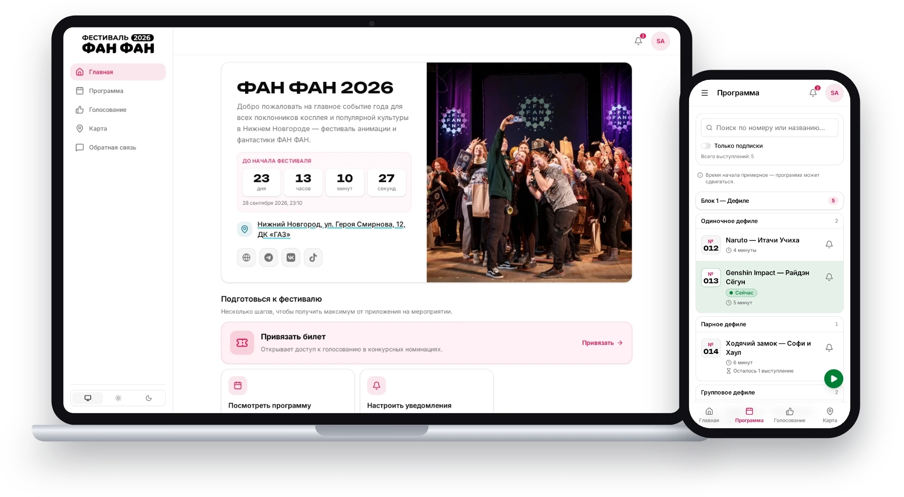

# FAN FAN

[](https://github.com/Arutemu64/fanapp/actions/workflows/ci.yml?query=branch%3Amain)
[](#license)



Companion web app for the **FAN FAN** Russian anime convention. It gives attendees the event schedule, voting, notifications, and ticket-linked profiles from their phone, and gives organizers the tools to run all of it. Audience is teen to young-adult and non-technical, so the UI is mobile-first and all user-facing copy is in Russian.

This is a monorepo: a FastAPI backend, a SvelteKit frontend, and a shared OpenAPI contract between them.

> [!NOTE]
> **This project is built with AI.** It started as a
> [Telegram bot](https://github.com/Arutemu64/fanfan-bot), written entirely by hand
> in Python, and later grew into a full-stack PWA. I don't write frontend, so the
> Svelte 5 / SvelteKit side is largely AI-generated; the backend is now written with
> heavy AI assistance too, as are most of the docs. The architecture, data model and
> requirements are mine, and I review everything before it lands.

## Features

- **Schedule** — public event schedule with live changes, per-user subscriptions, and organizer management/import tools.
- **Voting** — nominations and voting, with cosplay data synced from Cosplay2.
- **Notifications** — in-app feed plus Web Push (VAPID) for broadcasts and per-user alerts.
- **Auth** — sign in via Telegram, email code, one-time login code, or credentials; cookie-based sessions.
- **Profiles & tickets** — user profile, linked tickets (synced from TicketsCloud), account connections, and security settings.
- **Feedback** — user feedback submission.
- **Telegram bot** — companion bot sharing the same backend and domain logic.
- **Live updates** — Server-Sent Events (SSE) push real-time changes to the client.

## Stack

| Layer | Tech |
|---|---|
| Frontend | SvelteKit (Svelte 5 runes), Flowbite-Svelte, Tailwind CSS v4, `pnpm` |
| Backend | FastAPI, aiogram (Telegram bot), SQLAlchemy + Alembic, Dishka (DI), `uv` |
| Data / infra | PostgreSQL, Redis (Valkey), NATS + FastStream |
| Jobs | APScheduler (periodic syncs), FastStream consumers (domain events) |
| Tooling | Docker Compose, `just` task runner |

The backend follows clean / hexagonal architecture — pure `core` and `application` layers, infrastructure behind ports in `adapters`. See [`AGENTS.md`](AGENTS.md) and [`docs/`](docs/) for the full guidelines.

## Requirements

- Python ≥ 3.14.6 and [`uv`](https://docs.astral.sh/uv/)
- Node.js + [`pnpm`](https://pnpm.io/)
- [`just`](https://github.com/casey/just)
- Docker + Docker Compose (for the full environment)
- On **Windows**, run `just` from **Git Bash** (ships with
  [Git for Windows](https://git-scm.com/download/win)) or **WSL**, not cmd/PowerShell —
  the recipes are POSIX shell.

> Optional: [`mise`](https://mise.jdx.dev) (or `asdf`) reads the pinned
> versions from [`mise.toml`](mise.toml) — run `mise install` to get the exact
> Python / Node / pnpm / uv / just this repo expects in one step. Docker is not
> managed by mise; install it separately.

## Getting started

### 1. Configure

```sh
just bootstrap
```

This creates `.env` from the template, fills the generated secrets (DB / Redis /
NATS passwords, `WEB__SECRET_KEY`), and generates the Web Push VAPID keys
(`secrets/private_key.pem`, `secrets/public_key.pem`, `PUBLIC_VAPID_KEY`). It is
idempotent — re-run anytime; it never overwrites values you've already set.

Both the web API and the bootstrap defaults are designed to boot with no real
third-party credentials, so you can start exploring immediately:

- `BOT__*` — the placeholder values are format-valid, so the web API starts with
  them. Telegram login and Telegram notifications stay disabled until you set a
  real bot (create one via [@BotFather](https://t.me/BotFather)); email and
  credentials login work without it. The bot *process* needs a real token to run.
- `MAIL__*` (SMTP) — optional; leave unset and outgoing emails are logged instead
  of sent (email login/confirmation codes appear in the app logs).
- `PUSH__SUBSCRIBER` — your contact email for Web Push.

The optional integration blocks stay commented out.

Local (non-Docker) frontend dev reads this same root `.env` — there is no separate frontend env file.

### 2. Run with Docker (full environment)

```sh
just run-dev      # dev: hot-reload via Compose --watch
just run-prod     # prod: includes ops profile (pgbackup)
```

This brings up the frontend, API, FastStream consumer, scheduler, Postgres, Redis, and NATS. Migrations run automatically via the `migration` service.

- Frontend: http://localhost:3000
- API: http://localhost:8000

Both host ports are overridable if 3000/8000 are taken — set `FRONTEND_PORT` / `API_PORT` in `.env` (see `.env.example`). Update `Caddyfile.example` to match if you use it.

### 3. Run locally (without Docker)

Install dependencies, then start each side in its own terminal:

```sh
just backend-install
just frontend-install

just backend-migrate     # apply DB migrations (needs Postgres reachable)
just backend-dev         # FastAPI on :8000 (WEB__PORT)
just frontend-dev        # SvelteKit dev server on :3000 (FRONTEND_PORT)
```

## External integrations

Optional, enabled via `.env`:

- **TicketsCloud** (`TCLOUD__*`) — ticket sync.
- **Cosplay2** (`COSPLAY2__*`) — cosplay / voting data sync.
- **Yandex SmartCaptcha** (`SMARTCAPTCHA__SERVER_KEY` + `PUBLIC_SMARTCAPTCHA_CLIENT_KEY`) — bot protection on login-code requests. Unset = a no-op verifier that accepts everything. Yandex rather than Cloudflare Turnstile because Cloudflare is frequently throttled in Russia — see [ADR-0009](docs/adr/0009-yandex-smartcaptcha-over-cloudflare-turnstile.md).
- **Sentry / GlitchTip** (`DEBUG__SENTRY_DSN` backend, `PUBLIC_SENTRY_DSN` frontend) — error reporting. Empty DSN = disabled.
- **Scheduler** (`SCHEDULER__SYNC_*_CRON`) — cron strings (in `TIMEZONE`) that run the syncs periodically. Unset = disabled. After editing, `docker compose restart scheduler`. Trigger a sync manually any time with `docker compose run --rm api cli sync tcloud`.

## Common commands

All commands run from the repo root via `just`.

| Command | What it does |
|---|---|
| `just backend-dev` / `just frontend-dev` | Start backend / frontend locally |
| `just backend-migrate` | Apply Alembic migrations |
| `just backend-generate <name>` | Autogenerate a migration |
| `just backend-lint` | Format + lint + type-check backend |
| `just backend-typecheck` | Run `ty` type checker |
| `just frontend-lint` / `just frontend-check` | Lint / type-check frontend |
| `just frontend-generate-api` | Regenerate frontend API types from the OpenAPI spec |
| `just backend-sync tcloud` | Sync tickets from TicketsCloud |
| `just backend-sync cosplay2` | Sync cosplay data from Cosplay2 |

> The frontend talks to the backend through generated types in `frontend/src/lib/api/schema.d.ts`. Whenever backend endpoints or schemas change, run `just frontend-generate-api` to keep the contract in sync. CI fails if you forget: the spec is checked against the routers by a backend test, and the types against the spec by `just frontend-check-api`.

## Deployment

This section describes how the **FAN FAN** production server is run. If you are
deploying your own event, the same commands apply once you are publishing your
own images — see [Running this for your own event](#running-this-for-your-own-event)
first.

The server runs **prebuilt** GHCR images instead of building from source — only
the application *build* moves to CI, the runtime config stays on the host. Once
the server is set up, a deploy is:

```sh
just deploy                   # pull the images and restart; builds nothing on the host
```

To test the exact same images locally first, build them from your working tree with `just run-prod` (no registry needed).

Those images come from
[`.github/workflows/docker-publish.yml`](.github/workflows/docker-publish.yml),
which builds the backend and frontend and pushes them to the GitHub Container
Registry on pushes to `main` (moving the `latest` tag) and on `v*` tags. The
`SENTRY_AUTH_TOKEN` repository secret is passed only to the frontend build
(source-map upload); it is consumed in a discarded build stage and never ends up
in the published image.

[`docs/deployment.md`](docs/deployment.md) covers the rest: what the server needs on disk, one-time setup, pinning a build or rolling back with `IMAGE_TAG`, and the reverse proxy (Caddy) — including the single-origin setup that means **no CORS config is needed** and the `.env` values that change between HTTPS and plain-HTTP testing.

### Running this for your own event

> [!IMPORTANT]
> **The images published from this repository are built for the FAN FAN
> deployment — they are not a reusable product.** The frontend is a static SPA,
> so its `PUBLIC_*` values are baked into the bundle at build time: the published
> image carries *this* festival's VAPID public key, Yandex SmartCaptcha sitekey
> and Sentry DSN. Point it at your own backend and Web Push and the captcha
> break, and your users' errors are reported into our Sentry project. Both images
> also ship the festival branding, which is
> [excluded from the MIT grant](#license).

So **fork the repository and publish images from your fork**, then deploy those.
[`docs/deployment.md`](docs/deployment.md#reusing-this-for-another-event) walks
through the four things a fork has to change — branding, Actions variables, a
build to apply them, and the `image:` names in
[`docker-compose.prod.yml`](docker-compose.prod.yml) that still point at
`ghcr.io/arutemu64/…`. After that, `just deploy` pulls *your* images and the rest
of this section applies unchanged.

`PUBLIC_API_URL` is the one value you don't have to change: it defaults to the
relative `/api`, so the bundle itself stays domain-agnostic.

## Repository layout

```text
backend/    FastAPI app (core / application / adapters / presentation / main)
frontend/   SvelteKit app (routes + lib: components, api, services, utils)
shared/     Shared OpenAPI spec
config/     Committed, non-secret infra config (Redis)
secrets/    Gitignored runtime secrets (VAPID PEM keys); ships empty
docs/       Architecture guides and ADRs
```

## Contributing

Read [`AGENTS.md`](AGENTS.md) first — it holds the project constraints (Russian
user-facing copy, the import rules for `core`/`application`, which guide to read
for the area you're touching). The guides in [`docs/`](docs/) go deeper per area,
and [`docs/adr/`](docs/adr/README.md) records why the significant choices were
made.

Before pushing, run every gate locally:

```sh
just ci
```

Questions and bug reports go in [GitHub issues](https://github.com/Arutemu64/fanapp/issues)
— except security reports, which are private ([see below](#security)).

### Continuous integration

Every pull request and every push to `main` runs
[`.github/workflows/ci.yml`](.github/workflows/ci.yml) on GitHub Actions. It
mirrors the local quality gates:

- **Backend** — Ruff lint + format check, `ty` type check, and the full `pytest` suite. Integration tests spin up Postgres and Redis automatically via testcontainers (Docker is preinstalled on the runner).
- **Frontend** — Prettier + ESLint, `svelte-check`, and a production build.
- **Dockerfiles** — [hadolint](https://github.com/hadolint/hadolint) best-practice linting (config in [`.hadolint.yaml`](.hadolint.yaml)). Run locally with `just dockerfile-lint` (hadolint comes from `mise`) or via the pre-commit hook.
- **Images** — builds both Docker images without pushing, so a broken build fails on the PR instead of after merge. This is the one gate `just ci` skips; `just run-prod` builds the same two images locally.

CI is check-only: unlike `just backend-lint`, it never auto-fixes — a violation
fails the run. Each area is its own job so branch protection can require them
individually and a run reports a separate red/green check per area; each gate
runs only when its area changed (`dorny/paths-filter`), so a docs-only change
finishes in seconds. The `frontend` job further fans out into a
`lint`/`check`/`test`/`build` matrix, and within a job one failing gate doesn't
skip the rest — a run reports every problem in that area instead of only the
first. The reasoning behind the job split is in the header comment of
[`ci.yml`](.github/workflows/ci.yml).

[`renovate.json`](renovate.json) opens one PR per dependency every Monday
morning, automerging the ones that break loudly in CI — see
[`docs/dependencies.md`](docs/dependencies.md).

## Documentation

- [`AGENTS.md`](AGENTS.md) — monorepo guidelines and project constraints
- [`docs/backend.md`](docs/backend.md) — backend architecture (domain, ports, DI, events)
- [`docs/frontend.md`](docs/frontend.md) — SvelteKit SPA rules, styling, components
- [`docs/api.md`](docs/api.md) — type-safe API integration
- [`docs/testing.md`](docs/testing.md) — backend test layers and fixtures, what is real vs faked, frontend unit tests
- [`docs/deployment.md`](docs/deployment.md) — server setup, deploys and rollbacks, reverse proxy
- [`docs/dependencies.md`](docs/dependencies.md) — shared version pins and Renovate
- [`docs/claude-cloud.md`](docs/claude-cloud.md) — Claude Code on the web provisioning
- [`docs/adr/`](docs/adr/README.md) — architecture decision records

## Security

Found a vulnerability? Report it privately — see [`SECURITY.md`](SECURITY.md).
Please don't open a public issue, and please don't test against the live
festival deployment; `just run-dev` gives you the whole stack locally.

## License

[MIT](LICENSE) © Arutemu64. The MIT grant covers the **source code**. Two
categories of files in this repository are excluded from it.

**Festival branding and artwork.** The FAN FAN name, logo, festival maps and
event photography belong to the festival, not to this codebase, and carry no
license to reuse — the event photo in particular shows identifiable attendees,
who consented to a festival photo, not to redistribution under MIT. Excluded:

- `backend/src/fanfan/common/static/logo.png`
- `frontend/static/icons/`
- `frontend/src/lib/assets/map/`
- `frontend/src/routes/(app)/components/home/main.webp`
- `docs/assets/readme-header.webp`

Fork the code freely; swap in your own branding.

**Vendored third-party agent skills**, under `.agents/skills/`,
`.claude/skills/`, `.cline/`, `.gemini/` and `.impeccable/`. Each keeps its
upstream license and copyright; `skills-lock.json` records the source repository
for every one of them.
